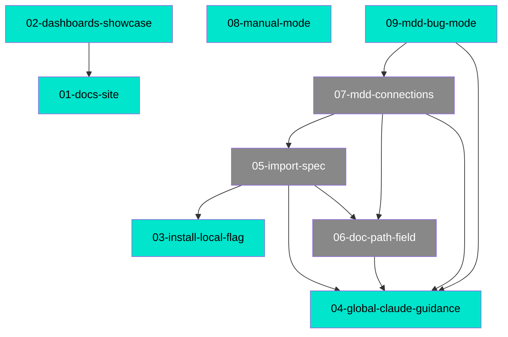

# MDD Connections

## Path Tree

```
Commands/
  ├── Bug Mode          09-mdd-bug-mode  complete
  └── Documentation     08-manual-mode  complete
Tooling/
  ├── Claude Guidance   04-global-claude-guidance  complete
  ├── Connections Graph 07-mdd-connections  draft
  ├── Dashboard         02-dashboards-showcase  complete
  ├── Docs Site         01-docs-site  complete
  ├── Import Spec       05-import-spec  draft
  ├── Install           03-install-local-flag  complete
  └── Path Field        06-doc-path-field  draft
```

## Dependency Graph



## Source File Overlap

| Source File | Referenced By |
|-------------|--------------|
| `README.md` | 01-docs-site, 02-dashboards-showcase |
| `docs/index.html` | 01-docs-site, 02-dashboards-showcase |
| `docs/user-guide.html` | 01-docs-site, 02-dashboards-showcase |
| `src/cli.ts` | 03-install-local-flag, 04-global-claude-guidance |
| `src/install.ts` | 03-install-local-flag, 04-global-claude-guidance |
| `commands/mdd.md` | 04-global-claude-guidance, 05-import-spec, 06-doc-path-field, 07-mdd-connections, 09-mdd-bug-mode |
| `commands/mdd-build.md` | 04-global-claude-guidance, 06-doc-path-field, 07-mdd-connections, 09-mdd-bug-mode |
| `commands/mdd-manage.md` | 04-global-claude-guidance, 06-doc-path-field, 07-mdd-connections |
| `commands/mdd-lifecycle.md` | 04-global-claude-guidance, 06-doc-path-field, 07-mdd-connections |
| `commands/mdd-import-spec.md` | 05-import-spec, 07-mdd-connections |

## Warnings

- 05-import-spec depends_on `06-doc-path-field` but that doc also depends_on `04-global-claude-guidance` which 05 also depends on directly — no cycle, but note shared ancestor
