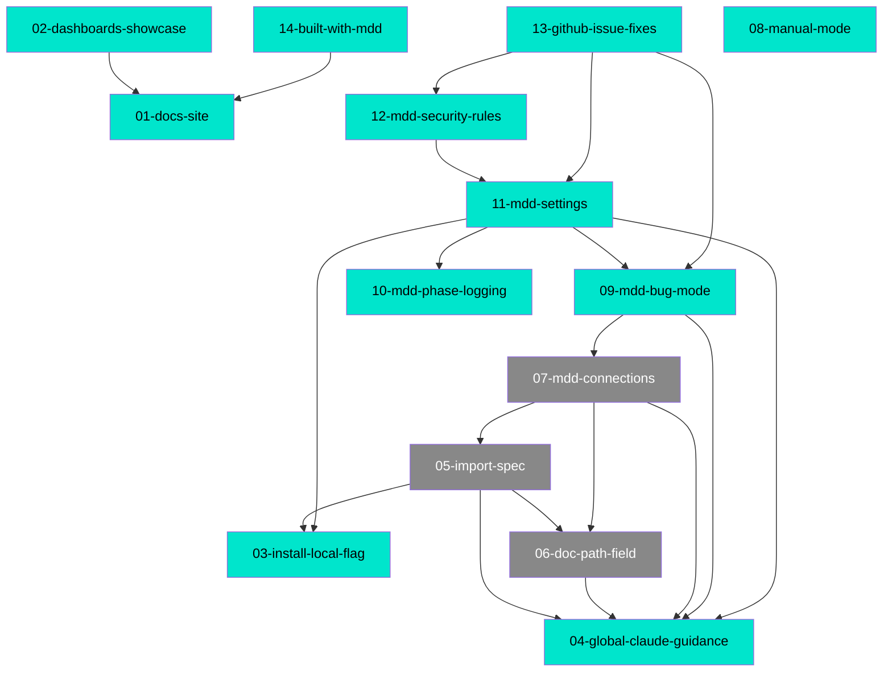

# MDD Connections

## Path Tree

```
Commands/
  ├── Bug Mode          09-mdd-bug-mode           complete
  └── Documentation     08-manual-mode            complete
Tooling/
  ├── Claude Guidance   04-global-claude-guidance  complete
  ├── Connections Graph 07-mdd-connections          draft
  ├── Dashboard         02-dashboards-showcase      complete
  ├── Docs Site         01-docs-site                complete
  │                     14-built-with-mdd           complete
  ├── Import Spec       05-import-spec              draft
  ├── Install           03-install-local-flag       complete
  ├── Logging           10-mdd-phase-logging        complete
  ├── Path Field        06-doc-path-field           draft
  ├── Security          12-mdd-security-rules       complete
  ├── Settings          11-mdd-settings             complete
  └── Workflow          13-github-issue-fixes       complete
```

## Dependency Graph



## Source File Overlap

| Source File | Referenced By |
|-------------|--------------|
| `README.md` | 01, 02 |
| `docs/index.html` | 01, 02, 14 |
| `docs/user-guide.html` | 01, 02 |
| `docs/styles.css` | 01, 14 |
| `src/cli.ts` | 03, 04 |
| `src/install.ts` | 03, 04, 11 |
| `commands/mdd.md` | 04, 05, 06, 07, 09, 10, 11, 12 |
| `commands/mdd-build.md` | 04, 06, 07, 09, 10, 11, 13 |
| `commands/mdd-manage.md` | 04, 06, 07, 10 |
| `commands/mdd-audit.md` | 04, 10, 11, 12, 13 |
| `commands/mdd-lifecycle.md` | 04, 06, 07, 10 |
| `commands/mdd-import-spec.md` | 07, 10 |
| `commands/mdd-plan.md` | 07, 10 |
| `commands/mdd-bug.md` | 09, 10 |
| `commands/mdd-rules-mcp.md` | 11, 13 |

## Warnings

- 09-mdd-bug-mode.md, 12-mdd-security-rules.md, 13-github-issue-fixes.md: source_files contain non-file-path strings — see audits/doc-findings-2026-05-21.md
- src/update-ecommerce.ts is a real shipped CLI sub-command with no feature doc
