# MDD Connections

## Path Tree

**Commands/Audit**
  └── `03-audit` - Audit Mode - Multi-Agent Parallel Codebase Audit (complete)
**Commands/Bug Mode**
  └── `06-bug` - Bug Mode - Bug Tracking with Feature Doc Integration (complete)
**Commands/Build**
  └── `02-build` - Build Mode - Feature Documentation and Implementation Workflow (complete)
**Commands/Documentation**
  └── `12-manual` - Manual Mode - User Manual Generator from MDD Docs (complete)
**Commands/Framework**
  └── `10-framework` - Framework Mode - MDD Ecommerce Module and Client Scaffolding (complete)
**Commands/Import Spec**
  └── `09-import-spec` - Import Spec Mode - Convert Spec Documents to MDD Feature Docs (complete)
**Commands/Lifecycle**
  └── `07-lifecycle` - Lifecycle Mode - Reverse-Engineer, Graph, and Upgrade (complete)
**Commands/Manage**
  └── `11-manage` - Manage Mode - Status, Note, Scan, Update, Deprecate, Tags, Connect (complete)
**Commands/Ops**
  └── `05-ops` - Ops Mode - Operational Runbook Creation and Execution (complete)
**Commands/Plan**
  └── `04-plan` - Plan Mode - Initiative and Wave-Based Feature Planning (complete)
**Commands/Router**
  └── `01-mdd` - MDD Router - Bootstrap, Mode Dispatch, Branch Guard (complete)
**Commands/Rules**
  └── `13-rules` - Stack Rule Files - Additive Audit and Build Checks by Technology (complete)
**Commands/Security**
  └── `08-security-rules` - Security Rules Mode - Vulnerability-Driven Audit Rule Generator (complete)
**Companion Tools**
  └── `20-dashboards` - Companion Dashboards - mdd-tui and mdd-dashboard (complete)
**Documentation**
  └── `15-mdd-documentation` - MDD Documentation - README and docs/ Site (complete)
**Meta/Schema**
  └── `00-frontmatter-spec` - Frontmatter Spec - Canonical Schema Reference (complete)
**Operations/Deploy**
  └── `17-deploy` - Deploy - Docs Site Docker Image and npm Release Runbook (complete)
**Operations/Logging**
  └── `18-logging` - Phase Logger - mdd-log-phase.sh Command Log (complete)
**Operations/Quality**
  └── `19-github-issue-fixes` - GitHub Issue Workflow - Surfacing Audit Findings as Public Issues (complete)
**Source/CLI**
  └── `14-npm-cli` - npm CLI - install, update, and update-ecommerce Commands (complete)
**Source/Scripts**
  └── `16-scripts` - Branch Guard Script - PreToolUse Hook for Main Branch Protection (complete)

## Dependency Graph

```mermaid
graph TD
  classDef complete fill:#00e5cc,stroke:#008080,color:#000
  classDef in_progress fill:#ffd700,stroke:#b8860b,color:#000
  classDef draft fill:#aaa,stroke:#666,color:#000
  classDef deprecated fill:#f44,stroke:#a00,color:#fff
  00_frontmatter_spec["00-frontmatter-spec"]:::complete
  01_mdd["01-mdd"]:::complete
  02_build["02-build"]:::complete
  03_audit["03-audit"]:::complete
  04_plan["04-plan"]:::complete
  05_ops["05-ops"]:::complete
  06_bug["06-bug"]:::complete
  07_lifecycle["07-lifecycle"]:::complete
  08_security_rules["08-security-rules"]:::complete
  09_import_spec["09-import-spec"]:::complete
  10_framework["10-framework"]:::complete
  11_manage["11-manage"]:::complete
  12_manual["12-manual"]:::complete
  13_rules["13-rules"]:::complete
  14_npm_cli["14-npm-cli"]:::complete
  15_mdd_documentation["15-mdd-documentation"]:::complete
  16_scripts["16-scripts"]:::complete
  17_deploy["17-deploy"]:::complete
  18_logging["18-logging"]:::complete
  19_github_issue_fixes["19-github-issue-fixes"]:::complete
  20_dashboards["20-dashboards"]:::complete
  02_build --> 01_mdd
  03_audit --> 01_mdd
  04_plan --> 01_mdd
  05_ops --> 01_mdd
  06_bug --> 01_mdd
  06_bug --> 02_build
  07_lifecycle --> 01_mdd
  08_security_rules --> 01_mdd
  08_security_rules --> 13_rules
  09_import_spec --> 01_mdd
  09_import_spec --> 04_plan
  10_framework --> 01_mdd
  10_framework --> 02_build
  11_manage --> 01_mdd
  12_manual --> 01_mdd
  13_rules --> 01_mdd
  13_rules --> 03_audit
  13_rules --> 02_build
  14_npm_cli --> 01_mdd
  15_mdd_documentation --> 01_mdd
  16_scripts --> 01_mdd
  16_scripts --> 14_npm_cli
  17_deploy --> 01_mdd
  17_deploy --> 15_mdd_documentation
  18_logging --> 01_mdd
  19_github_issue_fixes --> 01_mdd
  19_github_issue_fixes --> 03_audit
  20_dashboards --> 01_mdd
```

## Source File Overlap

Files referenced by 2+ docs:

(none)

## Warnings

(none)