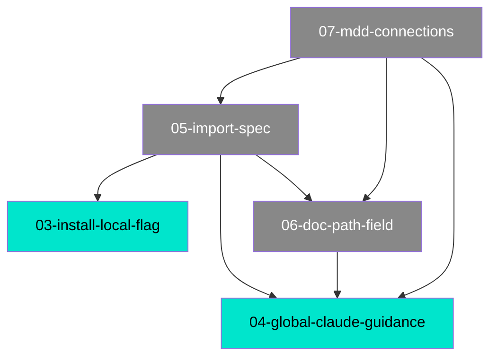

# 07 — MDD Connections — Project Relationship Graph

## Purpose

Adds a committed, always-current `.mdd/connections.md` file to every MDD project. This single file contains the complete relationship map — path tree, Mermaid dependency graph, and source-file overlap table — so Claude can load one file instead of reading every doc to understand project structure. The mdd-dashboard reads it directly for instant rendering. Every MDD operation that creates, modifies, or archives a doc regenerates this file automatically. It is never allowed to be stale.

## Architecture

```
.mdd/connections.md  ← committed to git, always current
       ↑
       │ regenerated by:
       ├── mdd-build.md        Phase 7c (feature complete)
       ├── mdd-manage.md       UPDATE Phase U5, DEPRECATE, REBUILD-TAGS, STATUS (staleness check)
       ├── mdd-lifecycle.md    UPGRADE Phase UP5
       ├── mdd-import-spec.md  Phase IS5
       ├── mdd-plan.md         PLAN-EXECUTE completion
       └── /mdd connect        manual regeneration command (new)
```

The file is generated by reading all `.mdd/docs/*.md` frontmatter (id, title, status, path, depends_on, source_files) — never the doc body. This keeps generation fast regardless of project size.

Staleness is detected by comparing the `generated:` date in connections.md against the most recent `last_synced` date across all docs. If any doc is newer than connections.md, it is stale.

## Data Model

One file per project: `.mdd/connections.md`

### File Structure

```markdown
---
generated: <YYYY-MM-DD>
doc_count: <N>
connection_count: <N total depends_on edges>
overlap_count: <N source files referenced by 2+ docs>
---

# MDD Connections

## Path Tree

<plain-text tree grouped by path field, sorted alphabetically within each level>

## Dependency Graph

```mermaid
graph TD
  <ID>["<NN>-<slug>"]:::<status> --> <ID>["<NN>-<slug>"]:::<status>
  ...
  classDef complete fill:#00e5cc,color:#000
  classDef in_progress fill:#ffaa00,color:#000
  classDef draft fill:#888,color:#fff
  classDef deprecated fill:#555,color:#aaa
```

## Source File Overlap
<table of source files referenced by 2+ docs — co-change risk>

## Warnings
<broken depends_on references, cycles, docs missing path>
```

### Example

```markdown
---
generated: 2026-05-14
doc_count: 8
connection_count: 4
overlap_count: 1
---

# MDD Connections

## Path Tree

Tooling
  ├── Claude Guidance    04-global-claude-guidance    complete
  ├── Connections Graph  07-mdd-connections           draft
  ├── Dashboard          02-dashboards-showcase       complete
  ├── Docs Site          01-docs-site                 complete
  ├── Import Spec        05-import-spec               draft
  ├── Install            03-install-local-flag        complete
  └── Path Field         06-doc-path-field            draft

## Dependency Graph



## Source File Overlap

| Source File | Referenced By |
|-------------|--------------|
| commands/mdd.md | 05-import-spec, 06-doc-path-field, 07-mdd-connections |

## Warnings

(none)
```

## Business Rules

### Rule 1 — Regenerate after every doc-mutating operation (ironclad)

**Every MDD mode that creates, modifies, or archives a doc MUST regenerate connections.md as its final step.** This is non-negotiable — it is what makes the file trustworthy as a lookup source.

Affected modes and their trigger points:

| Mode | Trigger point | Note |
|------|--------------|------|
| BUILD (mdd-build.md) | Phase 7c, after updating doc frontmatter to complete | Before showing completion signal |
| UPDATE (mdd-manage.md) | Phase U5, after rewriting doc sections | After any frontmatter change |
| DEPRECATE (mdd-manage.md) | After archiving the doc | After moving to archive/ |
| REBUILD-TAGS (mdd-manage.md) | After writing all tag values | Tags don't affect graph but keeps generated date current |
| UPGRADE (mdd-lifecycle.md) | Phase UP5, after patching all docs | Path values just changed — tree must be rebuilt |
| IMPORT-SPEC (mdd-import-spec.md) | Phase IS5, after writing all docs | Multiple new docs — full rebuild |
| PLAN-EXECUTE (mdd-plan.md) | After each wave feature completes | Incremental, after each Phase 7c |
| CONNECT (/mdd connect) | Immediately | Manual full rebuild, always |

### Rule 2 — Staleness detection in STATUS and SCAN

**STATUS MODE** must check connections.md on every run:
1. If `.mdd/connections.md` does not exist → report "⚠️ connections.md missing — run `/mdd connect` to generate"
2. If `generated:` date in connections.md is older than the most recent `last_synced` across all docs → report "⚠️ connections.md stale (last generated: X, newest doc: Y) — run `/mdd connect`"
3. If up to date → report "✅ connections.md current (generated: X, N docs, N edges)"

**SCAN MODE** must include connections.md as a scan target:
- Missing → add to findings as `broken`
- Stale → add to findings as `drifted`

### Rule 3 — Generation algorithm

Reading order: frontmatter only from all `.mdd/docs/*.md` (excluding `archive/`). Never read doc bodies — only id, title, status, path, depends_on, source_files.

**Path tree generation:**
1. Collect all (path, id, title, status) tuples
2. Sort by path alphabetically, then by id within same path
3. Build tree by splitting path on `/` — use `├──` for non-last siblings, `└──` for last
4. Each leaf line: `<path-segment><padding><id><padding><status>`

**Mermaid graph generation:**
1. Assign each doc a short node ID (A, B, C... or the numeric part of the doc ID)
2. For each `depends_on` entry: emit `<from> --> <to>`
3. Classify nodes with `:::<status>` suffix
4. Include `classDef` block for all four statuses
5. If no depends_on relationships exist anywhere → emit `graph TD\n  (no dependencies defined)` rather than an empty graph

**Source file overlap:**
1. Build a map of source_file → [doc IDs that reference it]
2. Keep only entries with 2+ docs
3. Sort by filename
4. If empty → omit the section entirely (or show "(none)")

**Warnings:**
1. Broken `depends_on` reference: a doc lists an ID that doesn't exist in `.mdd/docs/` → warn
2. Circular dependency: A→B→A → warn
3. Doc missing `path` field → warn (run `/mdd upgrade`)
4. If no warnings → show "(none)"

### Rule 4 — `/mdd connect` is the manual regeneration command

Triggered when arguments start with `connect`. Performs a full rebuild unconditionally — no staleness check needed, always regenerates.

Output:
```
🔗 Rebuilding connections.md...
   Read 94 docs (frontmatter only)
   Path tree: 12 root areas, 94 nodes
   Dependency graph: 47 edges
   Source overlap: 8 files referenced by 2+ docs
   Warnings: none

✅ .mdd/connections.md updated (2026-05-14)
```

### Rule 5 — connections.md is committed, never gitignored

Unlike `.mdd/audits/` (ephemeral) and `.mdd/jobs/` (ephemeral), `connections.md` is committed to git. It is part of the project's knowledge base. This means:
- The mdd-dashboard can read it without regenerating
- Claude sessions can load it from the repo without running any command
- Git history shows when the project's relationship structure changed

The bootstrap check (Step 0a in mdd.md) must NOT add connections.md to `.gitignore`.

### Rule 6 — First-time generation

If connections.md does not exist when any mode tries to regenerate it, generate it from scratch using the same algorithm. There is no "first-run" mode — the algorithm is always the same full rebuild.

The bootstrap check (Step 0a) does NOT auto-generate connections.md on first run — it is generated on demand by the first MDD operation that completes. This keeps bootstrap silent for new projects with no docs yet.

## Data Flow

Greenfield — reads frontmatter from `.mdd/docs/*.md`, writes `.mdd/connections.md`. No runtime data flows.

Input: all `.mdd/docs/*.md` frontmatter fields (id, title, status, path, depends_on, source_files)
Output: `.mdd/connections.md` (human-readable + Mermaid)

## Dependencies

- `04-global-claude-guidance` — connections.md is part of the session context pattern; STATUS mode staleness check follows the same awareness injection pattern
- `05-import-spec` — import-spec's Phase IS5 must regenerate connections.md after batch-creating docs
- `06-doc-path-field` — the path tree section depends on the path field being populated; connections.md warns on missing path

## Known Issues

(none — new feature)
