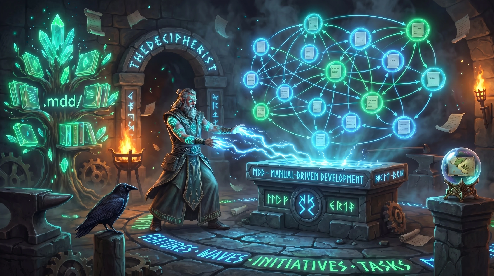
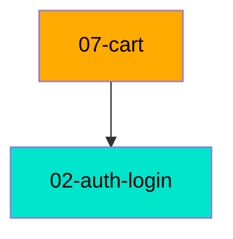

<p align="center">
  
</p>

# MDD - Manual-Driven Development for Claude Code

> **One command. Twenty-five modes. Complete feature lifecycle from documentation to verified deployment.**

<p align="center">
  <a href="https://mddai.dev">
    
  </a>
  &nbsp;
  <a href="https://mddai.dev/user-guide.html">
    
  </a>
</p>

[](https://www.npmjs.com/package/@thedecipherist/mdd)
[](https://opensource.org/licenses/MIT)
[](https://nodejs.org)

MDD turns Claude Code from a code generator into a structured development partner. Every feature starts with documentation. Every fix starts with an audit. No exceptions.

```bash
npm install -g @thedecipherist/mdd
mdd install
```

Then in Claude Code:
```
/mdd add user authentication with JWT tokens
```

📖 **[Full Documentation Site](https://mddai.dev)** · [User Guide](https://mddai.dev/user-guide.html) · [GitHub](https://github.com/TheDecipherist/mdd)

---

## Contents

- [Why MDD](#why-mdd)
- [How It Works](#how-it-works)
- [Installation](#installation)
- [Quick Start](#quick-start)
- [All 26 Modes at a Glance](#all-26-modes-at-a-glance)
- [Build Mode - Feature Development](#build-mode--feature-development)
- [Audit Mode - Code Review](#audit-mode--code-review)
- [Status & Notes](#status--notes)
- [Scan & Update - Drift Detection](#scan--update--drift-detection)
- [Feature Lifecycle](#feature-lifecycle)
- [Initiative & Wave Planning](#initiative--wave-planning)
- [Ops Runbooks](#ops-runbooks)
- [Feature Doc Format](#feature-doc-format)
- [The `.mdd/` Directory](#the-mdd-directory)
- [MDD Versioning](#mdd-versioning)
- [Real Results: Self-Audit](#real-results-self-audit)
- [History: From Starter Kit to Standalone Package](#history-from-starter-kit-to-standalone-package)
- [Dashboards](#dashboards)
- [Companion Tools](#companion-tools)
- [Projects Built with MDD](#projects-built-with-mdd)
- [License](#license)

---

## Why MDD

Most people prompt Claude Code like this: *"fix the bug in my auth system."* Claude reads 40 files, burns through context trying to understand your architecture, and produces something that technically compiles but misses the bigger picture.

MDD flips this. You write structured documentation first. Then Claude reads **one doc** instead of 40 files - getting the full picture in 200 tokens instead of 20,000.

**The core insight:** AI assistants work better when they have a map before they touch the territory. MDD is that map.

**The workflow: Document → Audit → Fix → Verify**

| Phase | What happens |
|-------|-------------|
| 📋 Document | Write feature docs with YAML frontmatter in `.mdd/docs/` before a line of code |
| 🔍 Audit | Read source code incrementally, write findings to disk (survives context compaction) |
| 📊 Analyze | Read notes only → produce severity-rated findings report with effort estimates |
| 🔧 Fix | Execute pre-planned fixes with test-driven green gate loop |
| ✅ Verify | Real HTTP calls, real DB, real browser - not mocked |

---

## How It Works

MDD installs one Claude slash command (`mdd.md`) plus six mode files read lazily at runtime. The main router reads your arguments and loads **only the mode file needed** — a `/mdd status` costs ~460 tokens instead of the full ~28,000.

```
~/.claude/commands/mdd.md          Router — Steps 0/0a/0b, mode dispatch, Branch Guard

~/.claude/mdd/
  mdd-build.md    (~680 lines)  BUILD MODE - Phases 0–7d
  mdd-audit.md    (~240 lines)  AUDIT MODE - Phases A1–A7
  mdd-manage.md   (~340 lines)  STATUS + NOTE + SCAN + UPDATE + DEPRECATE
  mdd-lifecycle.md (~350 lines) REVERSE-ENGINEER + GRAPH + UPGRADE
  mdd-plan.md     (~350 lines)  PLAN-INITIATIVE + PLAN-WAVE + PLAN-EXECUTE + PLAN-SYNC + …
  mdd-ops.md      (~380 lines)  OPS DOCUMENT + OPS EXECUTE + OPS UPDATE + OPS LIST + COMMANDS
```

**Lazy loading is the key optimization.** Each invocation pays only for the mode it needs. The full 28,000-token set is always available but never loaded unnecessarily. Mode files live in `~/.claude/mdd/` (not `commands/`) so only `/mdd` appears in the Claude Code command picker.

---

## Installation

```bash
npm install -g @thedecipherist/mdd
mdd install          # mdd.md → ~/.claude/commands/  |  mode files → ~/.claude/mdd/
```

After installation, `/mdd` is available in every Claude Code session globally - no per-project setup needed.

```bash
mdd update                        # update to latest installed version
mdd install --dir /custom/path    # install to a custom directory (skips CLAUDE.md injection)
mdd install --install-local       # install to .claude/commands/ + injects into ./CLAUDE.md
```

**Version safety:** `mdd install` compares `mdd_version` between the installed and available versions before overwriting. If you have a newer version installed, it won't silently downgrade.

### What `mdd install` sets up

| What | Where | Purpose |
|------|-------|---------|
| `mdd.md` (router) | `~/.claude/commands/` | The `/mdd` slash command entry point |
| 6 mode `.md` files | `~/.claude/mdd/` | Mode files (not exposed as commands) |
| Branch Guard hook | `~/.claude/hooks/mdd-branch-guard.sh` | Blocks file writes on `main` in any MDD project |
| Hook registration | `~/.claude/settings.json` | Wires the hook to Claude Code's PreToolUse event |
| Guidance block | `~/.claude/CLAUDE.md` | Teaches Claude to suggest MDD automatically |

---

## Branch Guard — Never Work on `main`

`mdd install` registers a **Claude Code `PreToolUse` hook** that fires before every file write (`Write`, `Edit`, `NotebookEdit`) in any project with a `.mdd/` directory. If the current branch is `main` or `master`, the hook blocks the operation:

```
⛔  MDD BRANCH GUARD

    File modification is blocked on branch 'main'.
    MDD never writes files directly on main or master.

    Create a feature branch, then re-run your /mdd command:

      git checkout -b feat/<feature-name>
```

**Why a hook and not just instructions?**

Instruction-based branch checks can be lost through Claude's context compaction (when a conversation grows very long, earlier context is summarised). A `PreToolUse` hook fires at the OS level on every tool call — it cannot be compacted away, forgotten, or bypassed by stale context.

**How it works end-to-end:**

1. MDD instructions enforce branch hygiene in every command file (Branch Guard in `mdd.md`, Phase 0 in `mdd-build.md`, Phase PE1 in `mdd-plan.md`).
2. The hook acts as a permanent failsafe. If Claude is about to write a file on `main`, the hook fires before the write happens, exits with code `2`, and the operation is blocked.
3. The hook is a no-op outside `.mdd` projects and on any non-`main`/`master` branch.

**MDD branch naming conventions:**

| Mode | Auto-created branch |
|------|---------------------|
| `/mdd <feature>` | `feat/<feature-slug>` |
| `/mdd audit` | `fix/mdd-audit-<YYYY-MM-DD>` |
| `/mdd plan-initiative` | `feat/init-<initiative-slug>` |
| `/mdd plan-wave` | `feat/<wave-slug>` |
| `/mdd plan-execute` | `feat/<wave-slug>` |

When on a clean `main`, MDD creates the branch automatically. When on `main` with uncommitted changes, MDD stops and offers to commit or stash first.

---

## Quick Start

```bash
# 1. Install globally
npm install -g @thedecipherist/mdd && mdd install

# 2. Open a project in Claude Code
# 3. Run your first /mdd command:
/mdd add user authentication with JWT tokens

# Claude will:
# - Ask a few focused questions about your feature
# - Write a feature doc to .mdd/docs/01-user-auth.md
# - Generate test skeletons (all red - that's the point)
# - Present a block-by-block build plan
# - Implement with a 5-iteration green gate loop
# - Verify against the real runtime environment
```

---

## Claude Automatically Suggests MDD

`mdd install` injects a small guidance block into your `~/.claude/CLAUDE.md` (or the project `CLAUDE.md` for `--install-local`). From that point on, whenever Claude detects a `.mdd/` directory in the current project it automatically evaluates every implementation or infrastructure request and suggests the right MDD workflow — even if you didn't type `/mdd`.

**What Claude checks, in order:**

**1. Does it already exist?**
Claude scans `.mdd/.startup.md` — which lists every documented feature and ops runbook with their tags. If your prompt overlaps with something already documented, Claude flags it before you duplicate work:

> *"This looks related to `02-user-auth` in your MDD docs. Want to use `/mdd update 02` to modify it, or `/mdd audit 02` to review it first?"*

**2. Is it ops/infrastructure?**
Deploy procedures, CI/CD pipelines, commit hooks, Docker builds, cron jobs, DNS changes — anything operational gets flagged for a runbook instead of ad-hoc implementation:

> *"This sounds like an ops procedure. Want to document it as a repeatable runbook with `/mdd ops deploy to production`?"*

**3. Is it initiative-scale?**
Large requests touching three or more independent concerns get routed to initiative/wave planning instead of a single feature doc:

> *"This looks initiative-scale. Want to plan it with `/mdd plan-initiative`?"*

**4. Is it a single new feature?**
Everything else gets the standard build mode prompt:

> *"Want me to use `/mdd add payment processing` to build this with documentation and tests first?"*

Claude always **asks** — it never auto-invokes `/mdd`. If you say no, it proceeds with direct implementation as normal. The detection is also intentionally narrow: bug fixes, typo corrections, config tweaks, and one-off shell commands are never flagged.

**How it detects overlap without loading full docs:**

Every feature doc and ops runbook has a `tags:` field (4–8 domain-concept keywords). These tags are surfaced in `.mdd/.startup.md` — a compact session-context file that's already injected into every Claude conversation. Claude scans the tag list in milliseconds, with no full-document loading and no context bloat.

```
## Features Documented
- 01-project-scaffolding (complete) [typescript, express, project-setup, scaffolding]
- 02-user-auth (in_progress) [auth, jwt, login, sessions, middleware]
- 03-payment-flow (draft) [stripe, payments, checkout, webhooks]

## Ops Runbooks
- prod-deploy [deploy, dokploy, docker, eu-west, canary, health-check]
```

**The injection is idempotent.** Running `mdd install` or `mdd update` again never duplicates the block.

---

## All 27 Modes at a Glance

```
/mdd <feature description>                 Build Mode - Document, plan, and implement
/mdd bug <description>                     Bug Mode - Fix bugs tracked in feature docs
/mdd manual [--force]                      Manual Mode - Generate a print-ready user manual
/mdd audit [section]                       Audit Mode - Scan code for violations and drift
/mdd security-rules                        Scan deps for vulnerabilities, generate stack rule files
/mdd status                                Overview: docs, tests, audit state, initiatives
/mdd scan                                  Detect features whose source files changed
/mdd update <feature-id>                   Re-sync a feature doc after code changes
/mdd rebuild-tags [--force]                Generate tags for all docs and rebuild .startup.md
/mdd connect                               Rebuild the connections map from all docs
/mdd note "text"                           Append a timestamped note to .mdd/.startup.md
/mdd note list                             Print the Notes section
/mdd note clear                            Wipe all notes (asks for confirmation)
/mdd deprecate <feature-id>                Archive a feature and flag all dependents
/mdd import-spec <file> [file...]           Convert a spec doc into MDD feature docs
/mdd reverse-engineer [path|feature-id]   Generate MDD docs from existing source code
/mdd graph                                 Render the full cross-feature dependency map
/mdd upgrade                               Batch-patch missing frontmatter across all docs
/mdd commands                              Show the full command reference in Claude
/mdd plan-initiative                       Create a new multi-wave initiative
/mdd plan-wave <wave-slug>                 Plan a wave within an existing initiative
/mdd plan-execute <wave-slug>             Run the build flow for every feature in a wave
/mdd plan-sync                             Reconcile manual edits to initiative/wave files
/mdd plan-remove-feature <wave> <feature>  Remove a feature from a wave
/mdd plan-cancel-initiative <slug>         Cancel an initiative and archive its waves
/mdd ops <description>                     Create a deployment runbook
/mdd ops list                              Show all runbooks (global and project)
/mdd runop <slug>                          Execute a runbook: pre-flight → canary → post-flight
/mdd update-op <slug>                      Edit an existing runbook
```

---

## Build Mode - Feature Development

Build mode is the core of MDD. It runs 7 phases with 3 mandatory gates.

**Pipeline:** Understand → Analyze → Document → Test Skeletons → **🔴 Red Gate** → Plan → Implement → **🟢 Green Gate** → Verify → **✅ Integration Gate**

### Phase 0 - Bootstrap & Mode Detection

Before anything else, MDD ensures the `.mdd/` directory structure exists (silently, no prompts). It also offers to create an isolated git worktree for parallel `/mdd` sessions, and checks the current branch to auto-create a feature branch.

### Phase 1 - Understand the Feature

MDD launches **3 parallel Explore agents** simultaneously to gather context before asking you anything:

- **Agent A (Rules):** reads `CLAUDE.md` and `project-docs/ARCHITECTURE.md` - returns coding rules, quality gates, architecture summary
- **Agent B (Features):** globs `.mdd/docs/*.md` - returns existing feature IDs, titles, statuses, dependency chains
- **Agent C (Codebase):** globs `src/**/*` - returns directory structure, key files, detected tech stack

After all three return, Claude asks you focused questions. For tooling tasks (docs, scripts, hooks) it skips the database and API questions automatically.

**Questions always asked:**
- Does this feature depend on any existing features?
- Are there edge cases or error scenarios you already know about?

**Questions for backend/API tasks:**
- Does this need database storage?
- Does this have API endpoints?
- Does this need authentication/authorization?
- Does this need real-time updates, background jobs, or external service integrations?

### Phase 2 - Data Flow & Impact Analysis

For non-greenfield projects, MDD traces every piece of data the feature will touch:

1. **Backend origin** - where is this value computed? Which file and line?
2. **API transport** - exact shape in the API response, TypeScript type
3. **Frontend consumption** - how the UI receives and transforms the value
4. **Parallel computations** - is the same concept computed elsewhere? Does it use the same logic?

Results go to `.mdd/audits/flow-<feature>-<date>.md`. A mandatory gate presents findings to you before documentation is written. **This gate is not skippable** - you must confirm before proceeding.

*Automatically skipped on greenfield projects (no existing docs + fewer than 5 source files).*

### Phase 3 - Write the Feature Doc

MDD creates `.mdd/docs/<NN>-<feature-name>.md` with this structure:

```markdown
---
id: 01-user-auth
title: User Authentication
depends_on: []
source_files:
  - src/handlers/auth.ts
  - src/hooks/useAuth.ts
routes:
  - POST /api/v1/auth/login
  - POST /api/v1/auth/logout
models:
  - users
test_files:
  - tests/unit/auth.test.ts
data_flow: .mdd/audits/flow-user-auth-2026-05-07.md
last_synced: 2026-05-07
status: draft
phase: documentation
mdd_version: 8
tags: [auth, jwt, login, sessions, middleware]
known_issues: []
---

# 01 - User Authentication

## Purpose
## Architecture
## Data Model
## API Endpoints
## Business Rules
## Data Flow
## Dependencies
## Known Issues
```

**The doc is the source of truth.** Everything that follows - tests, build plan, implementation - is generated from this document.

### Phase 4 - Test Skeletons

From the documented endpoints, business rules, and edge cases, MDD generates test skeletons:

```typescript
describe('User Authentication', () => {
  describe('POST /api/v1/auth/login', () => {
    it('should return 200 and JWT token on valid credentials', async () => {
      // Arrange
      // Act
      // Assert - minimum 3 assertions
      expect.fail('Not implemented - MDD skeleton');
    });

    it('should return 401 on invalid password', async () => {
      expect.fail('Not implemented - MDD skeleton');
    });
  });
});
```

For features needing both unit and E2E tests, two parallel agents write both files simultaneously.

### Phase 4b - Red Gate (mandatory)

Runs the new test files immediately after generation. **All tests must fail** before implementation begins. An unexpected pass means either the assertion is wrong or pre-existing code already satisfies it - both must be diagnosed before proceeding.

```
🔴 Red Gate: 12/12 failing (expected)
   All skeletons confirmed RED - ready to implement.
```

### Phase 5 - Build Plan

MDD presents a commit-worthy, layered build plan. Each block has:

- **End-state** - what is runnable when this block finishes
- **Commit scope** - a conventional commit one-liner
- **Verify** - exact command to prove the block is done
- **Handoff** - what the next block expects to exist

Blocks in the same dependency layer can be marked `Runs in: parallel agents` - MDD enforces a file-declaration gate (no two agents can write the same file) and a type-dependency gate before allowing parallelism.

### Phase 6 - Implement (Green Gate Loop)

For each block, MDD implements and runs the Green Gate:

```
Iteration 1–5:
  Run: pnpm test:unit -- --grep "<feature>" AND pnpm typecheck

  If ALL green → proceed to regression check
  If failing:
    DIAGNOSE (required before any fix):
      - What is the exact error message, file, and line?
      - Which implementation assumption was wrong?
      - What is the ONE targeted fix?
    FIX - implementation only (tests are NEVER modified)
    REPORT: "Iteration N - Root cause: X / Fix applied: Y"

Iteration 5 exhausted, still failing:
  STOP. Do not attempt iteration 6.
  Present options: (a) continue debugging, (b) narrow scope, (c) pause and review
```

After each block goes green, the full test suite runs to catch regressions.

### Phase 7 - Verify + Report

**Integration gate** - quality gates alone aren't enough. MDD verifies actual behavior:

- **Backend features:** real HTTP calls, real DB queries, response shape matches doc
- **Frontend features:** browser open, network tab inspection, console error check
- **Database features:** direct DB query confirmation, EXPLAIN on primary patterns
- **Tooling features:** run against real scenario, verify output matches doc

The ownership default: *"My code is wrong until proven otherwise."* Before accepting any external blocker, MDD runs a minimal probe and forms a specific falsifiable hypothesis.

On completion, MDD offers to commit and merge:
- **Commit & merge** - stages, commits with a conventional message, merges to main
- **Commit only** - commits on the feature branch, offers to push
- **Skip** - leaves git state for manual handling

---

## Audit Mode - Code Review

Audit mode scales with file count, running 1–8 parallel agents depending on scope:

| Files in scope | Agents |
|---|---|
| < 10 | 1 (single-agent mode) |
| 10–25 | 2 |
| 26–50 | 3 |
| 51–100 | 5 |
| 100+ | 8 (default ceiling, overridable via `MDD_MAX_AGENTS`) |

### The Manifest System

Before spawning a single agent, MDD writes a manifest to `.mdd/jobs/audit-<date>/MANIFEST.md`:

```
## Shard 1 (Agent 1) - files 1-15
[ ] src/handlers/auth.ts
[ ] src/handlers/users.ts
...

## Shard 2 (Agent 2) - files 16-30
[ ] src/handlers/billing.ts
```

State transitions: `[ ] pending → [~] in progress → [x] complete → [!] has findings → [e] error`

**Why this matters:** If Claude's context is compacted mid-audit, the manifest survives. Each agent reads its config file on startup, finds the first `[ ]` in its shard, and resumes exactly where it left off. No findings are lost.

### Per-Agent Config

Each agent receives a self-contained config file (not the source code):

```
# Agent 1 Audit Config
Shard file:  .mdd/jobs/audit-<date>/shard-1.md
Notes file:  .mdd/jobs/audit-<date>/agent-1-notes.md
Manifest:    .mdd/jobs/audit-<date>/MANIFEST.md

Startup Sequence:
1. Read this config file
2. Read shard-1.md to know your file list
3. Read MANIFEST.md - find the first [ ] entry in Shard 1
4. Read the last 20 lines of agent-1-notes.md for continuity
5. Begin the per-file loop
```

### Per-File Loop

Each agent follows this exact loop for every file:

1. Mark file as `[~]` in MANIFEST (write to disk first - before reading)
2. Read the source file fully
3. Analyze against audit criteria
4. Append to `agent-N-notes.md`
5. Mark file as `[x]` or `[!]` in MANIFEST
6. **Clear context** - every file gets a fresh context window

**Context clear is mandatory.** The notes file and manifest are the memory. Every file gets maximum analysis budget.

### Audit Phases

- **A1 - Scope:** reads all `.mdd/docs/`, `.mdd/ops/`, resolves source files, detects interrupted audits
- **A2 - Config Setup:** writes shard files and config files for each agent before spawning
- **A3 - Parallel Execution:** all agents run simultaneously
- **A4 - Convergence:** main checks for any `[ ]` or `[~]` entries, re-runs stale shards
- **A5 - Merge:** merges all agent notes into `audits/notes-<date>.md` in manifest order
- **A6 - Analyze:** reads notes only (not source again) → produces `audits/report-<date>.md`
- **A7 - Present & Fix:** shows findings by severity, offers to fix all / P1+P2 only / review first

### Audit Report Format

```
🔍 MDD Audit Complete

Findings: 20 total (3 P1 Critical, 5 P2 High, 8 P3 Medium, 4 P4 Low)
Report: .mdd/audits/report-2026-05-07.md

Top issues:
  1. Raw database connection in src/handlers/billing.ts (P1 - use StrictDB)
  2. JWT secret hardcoded in src/middleware/auth.ts (P1 - use env var)
  3. No rate limiting on /api/v1/auth/login (P2)

Estimated fix time: 6 hours (traditional) → 45 minutes (MDD)
```

### Resuming an Interrupted Audit

If an audit is interrupted (context limit, manual stop), re-running `/mdd audit` detects the stale job:

```
Found interrupted audit from 2026-05-07.
MANIFEST shows 23/57 files complete.

  [R] Resume - continue from where it left off
  [D] Discard - delete and start fresh
```

---

## Status & Notes

### `/mdd status`

Gives a complete project snapshot:

```
📊 MDD Status

Feature docs:     9 files in .mdd/docs/
Ops runbooks:     2 files in .mdd/ops/
Last audit:       2026-05-01 (20 findings, 17 fixed, 3 open)
Test coverage:    125 unit tests, 8 E2E tests
Known issues:     3 tracked across 2 features
Quality gates:    0 files over 300 lines

Initiatives:      1 total (1 active)
  Active waves:   auth-system-wave-2 [1/2 features complete]

MDD version:      v8 - all files up to date

Drift check:
  8 features in sync
  1 feature possibly drifted  ← run /mdd scan for details
```

After collecting status, `/mdd status` rebuilds `.mdd/.startup.md` - the session context file that gets loaded at the start of every Claude Code session, keeping Claude oriented without requiring a full codebase read.

### `/mdd note`

Three subcommands for maintaining a running log in `.mdd/.startup.md`:

```bash
/mdd note "switched from PostgreSQL to SQLite for dev"
/mdd note list      # print all notes
/mdd note clear     # wipe notes (asks for confirmation)
```

Notes are timestamped and survive session resets.

---

## Scan & Update - Drift Detection

### `/mdd scan`

Detects which features have drifted since their last MDD session, and checks whether `connections.md` is stale. Uses a single Explore agent to run all git checks in parallel, then classifies each feature:

| Classification | Meaning |
|---|---|
| ✅ in_sync | `last_synced` exists, all files exist, no commits after sync date |
| ⚠️ drifted | Commits found after `last_synced` - doc may be stale |
| ❌ broken | One or more `source_files` not found on disk |
| ❓ untracked | No `last_synced` field in frontmatter |

```
🔍 MDD Scan - Drift Report

  ✅ 01-project-scaffolding   - in sync (last synced: 2026-04-15)
  ⚠️  04-content-builder       - DRIFTED (3 commits since 2026-04-01)
                                  Latest: "fix: markdown heading parser"
  ❌  07-github-pages           - broken reference (docs/index.html not found)

Recommended actions:
  /mdd update 04   - re-sync content-builder doc with code
  /mdd update 07   - fix broken file reference
```

### `/mdd update <feature-id>`

Re-syncs a feature doc after its code has changed:

1. Reads the current source files
2. Diffs doc vs code (new functions, removed endpoints, changed business rules)
3. Presents a change summary and asks for confirmation
4. Rewrites only the affected sections (preserves `known_issues`, `depends_on`)
5. Generates test skeletons for any new documented behaviors
6. Updates `last_synced` to today

```bash
/mdd update 04          # by number
/mdd update 04-content-builder  # by full slug
```

---

## Import Spec Mode

### `/mdd import-spec <file> [file...]`

Converts one or more large spec or prompt documents — the kind produced by extended brainstorming sessions — into properly structured MDD feature docs. Nothing from the original spec is lost.

```bash
/mdd import-spec ~/specs/my-app-prompt.md
/mdd import-spec spec-v1.md spec-v2.md spec-notes.md
```

**How it works:**

1. **Read** — loads all spec files, merges content if multiple are provided
2. **Extract + Group** — identifies distinct features and assigns each a `path` value (e.g. `Auth/Login`, `E-commerce/Cart`) before anything else
3. **Auto-detect structure** — decides whether to create initiatives + waves + docs, waves + docs, or flat feature docs, based on path diversity and feature count:

| Signal | Output |
|--------|--------|
| 3+ distinct root path areas AND 8+ features | Initiative → Waves → Feature docs |
| 4–7 features in a coherent domain | Waves → Feature docs |
| 1–3 focused features | Flat feature docs only |

4. **Dry-run preview** — shows the complete proposed tree (paths, slugs, titles, content mapping, merge summary) before writing a single file. You can adjust or abort.
5. **Write docs** — creates all feature docs with full frontmatter, populated sections, tags, and `path` fields
6. **Rebuild** — updates `.mdd/.startup.md` to reflect the new docs

**Content preservation:** Every decision, constraint, and edge case in the spec maps somewhere in the output. If something doesn't fit cleanly into a standard section, it goes into Business Rules or a Known Constraints note.

**Duplicate handling:** Specs often revisit the same topic multiple times. Import-spec detects overlapping sections semantically, merges them into the best doc, and shows you exactly what was merged and why in the dry-run summary.

---

## Manual Mode

### `/mdd manual [--force]`

Generates a comprehensive, print-ready user manual at `.mdd/manual/manual.md` from all MDD feature docs and ops runbooks. Uses content hashes so only changed sections are regenerated — running it repeatedly is fast.

```bash
/mdd manual           # incremental — only regenerate changed sections
/mdd manual --force   # regenerate everything from scratch
```

**What it produces:**

A single `manual.md` file with:
- **Table of Contents** — auto-generated with anchor links
- **Project Overview** — synthesized from `.mdd/.startup.md` and `README.md`
- **Feature sections** — one per MDD feature doc, written in plain English for a non-technical reader. Each section includes: what it does, how to use it, commands, API endpoints, configuration options, and examples.
- **Operations chapter** — runbooks from `.mdd/ops/` formatted as step-by-step procedures
- **Command Reference** — aggregated table of all CLI commands across all features
- **API Reference** — aggregated table of all HTTP endpoints (omitted if none)
- **Configuration** — aggregated table of all env vars and options (omitted if none)

**How the hash check works:**

On each run, MDD computes SHA256 of every doc file and compares against `.mdd/manual/.hashes.json`. Sections backed by unchanged docs are left as-is. Only changed, new, or deleted docs trigger section regeneration. `--force` bypasses this and rebuilds everything.

**Designed for publishing:** The output is clean markdown with no internal file paths, no jargon without definition, active voice, and real examples. Export to PDF, paste into a blog post, or use as source material for docs sites.

**Handles deletions:** If a feature doc is removed between runs, its section is cleanly removed from `manual.md` and its hash entry is dropped.

---

## Feature Lifecycle

### `/mdd deprecate <feature-id>`

Archives a feature cleanly and flags all dependents:

1. Shows a deprecation summary including which other features depend on this one
2. Moves the doc to `.mdd/docs/archive/`
3. Adds a `known_issues` warning to each dependent doc
4. Asks separately about deleting source files and test files - never auto-deletes

### `/mdd reverse-engineer [path|feature-id]`

Generates MDD documentation from existing undocumented code:

- **No argument:** scans `src/` for files not registered in any `.mdd/docs/*.md`
- **File path:** generates a doc for that specific file
- **Feature ID:** regenerates an existing doc - shows a before/after comparison

For 4+ files, uses parallel Explore agents to read in batches. Always discloses limitations upfront:

```
⚠️  Reverse-engineer limitations:
   - "Purpose" section is inferred - review business intent carefully
   - Implicit constraints (SLAs, compliance, product decisions) are not captured
   - Confirm accuracy before treating this doc as the source of truth
```

### `/mdd graph`

Renders the full cross-feature dependency map and detects issues:

- **Broken dependency:** depends on a deprecated/archived feature
- **Risky dependency:** a `complete` feature depends on a `draft` or `in_progress` one
- **Orphan:** a feature with no dependents and no dependencies
- **Task dependency:** a feature incorrectly lists a one-off task doc in `depends_on`

```
📊 MDD Dependency Graph

  06-command-system ──────────────────► 01-project-scaffolding
  09-integrations ────────────────────► 06-command-system
  04-content-builder ─────────────────► 03-database-layer

Issues:
  ⚠️  09-integrations depends on 06-command-system (status: in_progress) - risky
  ❌  05-testing-framework depends on 10-old-auth (deprecated) - broken
```

Saved to `.mdd/audits/graph-<date>.md`.

### `/mdd upgrade`

Batch-patches missing frontmatter fields (`last_synced`, `status`, `phase`, `tags`, `path`) across all `.mdd/docs/*.md` files. Safe to run multiple times — already-present fields are never overwritten.

Infers sensible defaults from git history, existing field values, and archive status. For the `path` field, Claude reads each doc's title and purpose to propose a value — always shows a plan for confirmation before writing. After upgrade, run `/mdd rebuild-tags` to populate any empty `tags` fields.

---

## Initiative & Wave Planning

For large features that span multiple weeks or deployment cycles, MDD provides a structured planning system.

### Initiatives

An initiative is a named goal decomposed into waves. Each wave has a "demo-state" - something concrete that a user can do when the wave is complete.

```bash
/mdd plan-initiative    # creates a new initiative with named waves
```

This writes `.mdd/initiatives/<slug>.md` with a hash-locked frontmatter. If you manually edit the file, MDD detects the hash mismatch on the next operation and requires you to run `/mdd plan-sync` first.

### Waves

Each wave is a set of features that collectively deliver the demo-state.

```bash
/mdd plan-wave auth-system-wave-1   # plan a wave's features and dependencies
```

Before planning a wave, MDD enforces:
- **Open questions gate:** all product questions must be resolved before wave planning
- **Depends-on gate:** the wave's dependency (another wave) must be `complete` first
- **Feature ordering check:** internal feature dependencies within the wave are validated

### Execution

```bash
/mdd plan-execute auth-system-wave-1   # run full MDD build for each feature in order
```

Two modes:
- **Automated** - minimal interruptions, pauses only on 5-iteration failures or integration failures
- **Interactive** - full MDD gates on every feature, full plan confirmations

Features are executed in dependency order, skipping already-`complete` ones. If interrupted, re-running resumes from the first `active` or `planned` feature.

### Sync, Remove, Cancel

```bash
/mdd plan-sync                              # reconcile manual edits via hash comparison
/mdd plan-remove-feature <wave> <feature>  # remove a feature from a wave
/mdd plan-cancel-initiative <slug>         # cancel initiative, archive waves, flag feature docs
```

---

## Ops Runbooks

Deployment runbooks for reproducing infrastructure operations reliably.

### Creating a Runbook

```bash
/mdd ops deploy swarmk to dokploy
```

MDD asks: project-local (`.mdd/ops/`) or global (`~/.claude/ops/`)? Global runbooks are reusable across all projects. A collision check prevents project runbooks from shadowing global ones.

The runbook format includes:
- **Services** - each service with its Docker image, port, and health check command
- **Regions** - deployment targets with `deploy_order` and `role` (canary/primary)
- **Deployment strategy** - sequential or parallel, gate type (`health_check` / `manual` / `none`), `on_gate_failure` behavior
- **Credentials** - env var names only (never values)
- **MCP servers** - any MCP tools required during deployment

### Executing a Runbook

```bash
/mdd runop swarmk-dokploy
```

Execution flow:
1. **Pre-flight health check** - runs each service's health check across all regions, displays a status table
2. **Deploy region by region** (in `deploy_order`):
   - Deploy unhealthy services
   - Run the region gate (health check / manual confirm / automatic)
   - On gate failure: `stop` / `skip_region` / `rollback` per config
3. **Post-flight health check** - full cross-region before/after table
4. **Summary** - pass/fail per region, steps executed, `last_synced` updated in runbook

```bash
/mdd ops list       # show all runbooks (global + project) with last-run status
/mdd update-op <slug>   # edit a runbook, re-ask all questions with current values pre-filled
```

---

## Feature Doc Format

Every `.mdd/docs/<NN>-<feature-name>.md` file uses this YAML frontmatter:

| Field | Purpose |
|-------|---------|
| `id` | Auto-numbered slug (e.g., `01-user-auth`) |
| `title` | Human-readable title |
| `edition` | Project name or `Both` |
| `depends_on` | List of feature doc IDs this feature requires |
| `source_files` | Files that will be created or modified |
| `routes` | API routes (e.g., `POST /api/v1/auth/login`) |
| `models` | Database collections/tables used |
| `test_files` | Test files for this feature |
| `data_flow` | Path to flow analysis doc, or `greenfield` |
| `last_synced` | Date of last doc-to-code sync (drives drift detection in `/mdd scan`) |
| `status` | `draft` → `in_progress` → `complete` → `deprecated` |
| `phase` | Last completed phase name |
| `mdd_version` | Version of MDD that created/last updated this doc |
| `tags` | 4–8 domain-concept keywords surfaced in `.startup.md` so Claude can detect when a prompt relates to this feature (e.g. `[auth, jwt, login, sessions]`) |
| `path` | Slash-delimited breadcrumb showing where this feature lives in the product (e.g. `Auth/Login`, `E-commerce/Cart/Checkout`). Used by dashboards and listing tools to group docs into a human-readable tree. Distinct from `depends_on` — this is for navigation, not build order. |
| `known_issues` | Issues discovered during audits or implementation |
| `security_read_sites` | Optional. List of `file:line` entries where user-supplied file paths are read. Phase A1 cross-checks each against path-confinement calls - a listed site with no guard is a P1 finding. Leave empty or omit if the feature has no file-read attack surface. |

**`depends_on` rules:**
- Feature docs only - never list task docs (one-off, frozen, no ongoing contract)
- IDs must reference existing docs - `/mdd graph` detects broken references
- Only add, never remove without discussion - removing breaks the dependency chain

**`path` rules:**
- Format: `Area/Section` or `Area/Section/Detail` — Title Case, slash-separated, 1–3 levels
- Use product vocabulary, not code paths: `Auth/Login` not `src/handlers/auth`
- Siblings must use identical parent spelling: if `Auth/Login` exists, new auth docs use `Auth` not `Authentication`
- Set automatically by Claude in Build Mode Phase 3 (inferred from context, confirmed by user if ambiguous)
- Missing `path` fields are detected by `/mdd scan` and batch-fixed by `/mdd upgrade`
- Dashboards and listing tools use `path` to group docs into a human-readable tree view

---

## Connections Map

Every MDD project maintains a committed `.mdd/connections.md` file — a pre-computed relationship map that gives Claude and the dashboard instant access to the full project graph without reading every doc.

```bash
/mdd connect    # regenerate manually at any time
```

It contains three sections:

**Path Tree** — all feature docs grouped by their `path` field, sorted alphabetically, ready for dashboard rendering:
```
Auth
  ├── Login     02-auth-login    complete
  └── OAuth     03-oauth-google  draft
E-commerce
  └── Cart      07-cart          in_progress
```

**Dependency Graph** — a Mermaid diagram of all `depends_on` relationships with status-coded nodes:


**Source File Overlap** — files referenced by 2+ docs (co-change risk):
```
src/handlers/auth.ts → 02-auth-login, 03-oauth-google
```

**Kept in sync automatically** — every MDD operation that creates, modifies, archives, or upgrades a doc regenerates `connections.md` as its final step. `/mdd status` and `/mdd scan` detect and flag staleness. The file is committed to git (not gitignored) so it's always available without re-running any command.

---

## The `.mdd/` Directory

All MDD artifacts live in one place:

```
.mdd/
├── docs/                         # Feature documentation (one .md per feature)
│   ├── 01-<feature-name>.md      # auto-numbered, YAML frontmatter
│   └── archive/                  # Deprecated or cancelled feature docs
├── initiatives/                  # Initiative files (/mdd plan-initiative)
├── waves/                        # Wave execution files (/mdd plan-wave)
├── ops/                          # Project-scoped deployment runbooks
├── audits/                       # ⚠️ gitignored - regenerated by /mdd audit
│   ├── flow-<feature>-<date>.md  # Data flow analysis (Phase 2)
│   ├── notes-<date>.md           # Raw reading notes (Audit Phase A5)
│   ├── report-<date>.md          # Severity-rated findings (Audit Phase A6)
│   ├── scan-<date>.md            # Drift report (/mdd scan)
│   ├── graph-<date>.md           # Dependency graph (/mdd graph)
│   └── MANIFEST-<date>.md        # Permanent audit manifest (which files had findings)
├── jobs/                         # ⚠️ gitignored - auto-deleted when audit completes
│   └── audit-<date>/             # Active audit job (agents write here during audit)
│       ├── MANIFEST.md
│       ├── shard-N.md
│       ├── agent-N-config.md
│       └── agent-N-notes.md
├── .startup.md                   # Auto-generated session context (read by Claude on start)
├── settings.json                 # Stack config — auto-populated by discovery, committed to git
└── connections.md                # Pre-computed relationship map (path tree + Mermaid graph)
```

`.mdd/audits/` and `.mdd/jobs/` are automatically added to `.gitignore` on first run. Everything else in `.mdd/` is committed - it's your project's knowledge base.

### The `.startup.md` File

This file is the session context that orients Claude at the start of every conversation. MDD rebuilds it automatically after every `status`, `audit`, or `note` command:

```markdown
## Project Snapshot
Generated: 2026-05-07 | Branch: feat/user-auth

## Stack
Framework: Express + React | DB: PostgreSQL | Host: Dokploy

## Features Documented
- 01-project-scaffolding (complete) [typescript, express, project-setup, scaffolding]
- 02-user-auth (in_progress) [auth, jwt, login, sessions, middleware]
- 03-payment-flow (draft) [stripe, payments, checkout, webhooks]

## Ops Runbooks
- prod-deploy [deploy, dokploy, docker, eu-west, canary, health-check]

## Last Audit
2026-05-01 - 20 findings, 17 fixed, 3 open

## Rules Summary
[key rules from CLAUDE.md]

---
## Notes
- [2026-05-07] switched from JWT lib to jose for better ESM support
```

The auto-generated section above the `---` is rebuilt each time. The Notes section below is append-only and preserved.

---

## Stack Settings

MDD creates `.mdd/settings.json` on first run. It controls which rule files load during audit and build phases, whether stack detection runs automatically, and a few other session behaviours.

```json
{
  "autoDiscovery": true,
  "stack": {
    "language": ["typescript"],
    "runtime": ["node"],
    "frameworks": ["express"],
    "orm": ["prisma"],
    "auth": ["jwt"]
  },
  "overrides": {},
  "phaseLogging": true,
  "securityScan": false
}
```

**`autoDiscovery: true` (default)** - MDD scans your manifest files once at session start and writes the detected stack into `settings.json`. It checks `package.json`, `go.mod`, `pyproject.toml`, and `composer.json`. The `stack` field is owned by discovery when this is on; `overrides` is always yours to edit.

**`autoDiscovery: false`** - MDD reads `settings.json` as-is. You control the stack manually. Useful when your dependencies don't reflect the full picture (custom implementations, monorepos, unusual setups).

**`overrides`** - Merged on top of `stack` at phase time. Add anything discovery misses - custom auth implementations, internal frameworks, or anything else that needs stack-specific rules.

**`phaseLogging: true` (default)** - Controls whether MDD writes phase timing data via `mdd-log-phase.sh`. Set to `false` to suppress all phase log output.

**`securityScan: false` (default)** - Set to `true` to enable the security rule generator. See the section below.

### Stack-Specific Rule Files

Once MDD knows your stack, it loads matching rule files at the start of each audit and build phase. These files live in `~/.claude/mdd/` alongside the other mode files and are installed with `mdd install`.

```
mdd-rules-typescript.md   # TypeScript-specific audit criteria and build checklists
mdd-rules-express.md      # Express error handling, middleware, route validation rules
mdd-rules-jwt.md          # JWT decode safety, expiry checks, secret validation
mdd-rules-prisma.md       # Prisma query safety, transaction patterns, migration checks
mdd-rules-mcp.md          # MCP tool input validation and rejection test enforcement
```

Rules are additive - they append criteria to the existing phase rather than replacing anything. If a rule file doesn't exist for a stack entry, MDD warns once and continues. A misconfigured or missing `settings.json` never halts a session.

### Security Rule Generator

When `securityScan: true`, MDD runs a vulnerability scan against your declared stack and generates new audit rules for any patterns not already covered.

```bash
# Runs automatically during /mdd audit when securityScan: true
# Or run directly:
/mdd security-rules
```

**How it works:**

1. Scans your dependencies using free tools - `npm audit` for Node projects, `osv-scanner` for multi-language, Snyk CLI free tier if installed. No API keys required.
2. Reads all existing `mdd-rules-{stack}.md` files and extracts the current rule set.
3. For each vulnerability found: checks whether the attack vector is already covered by an existing rule.
4. If a gap exists: generates a new rule targeting the vulnerability *class*, not just the specific CVE. A rule about "prototype pollution via unvalidated query parameters" will catch future variants, not just the package version that triggered it.
5. Appends new rules to the relevant `mdd-rules-{stack}.md` file with the source CVE as a reference.

```
Security rule generator - 2026-05-20

Sources: npm audit, osv-scanner
Findings reviewed: 12
Already covered by existing rules: 9
Gaps found: 3

New rules generated:
  mdd-rules-express.md  +2 rules
    - [P2] Prototype pollution via req.query or req.body merge — use structuredClone() or
      a safe merge utility. Reference: CVE-2024-29041
    - [P2] res.redirect() called with user-supplied path without allowlist validation.
      Reference: CVE-2024-43796

  mdd-rules-jwt.md  +1 rule
    - [P2] jwt.decode() used instead of jwt.verify() — decode skips signature check.
      Reference: CVE-2022-21449 (class)
```

The gap check uses semantic comparison, not string matching, so rules generated in a previous run are not duplicated even if they use different wording. Each generated rule includes the CVE ID so you can trace where it came from and review or remove it if needed.

---

## MDD Versioning

Every file created by MDD is stamped with `mdd_version: N` in its frontmatter. This tracks which version of the workflow created or last updated each doc.

```bash
mdd install   # compares versions before overwriting - no silent upgrades
/mdd status   # shows version breakdown across all docs
```

Current MDD version: **8**

`/mdd status` version output:
```
MDD version: v8 (current)
  v8: 9 files - up to date
  v7: 2 files - run /mdd upgrade to refresh these docs
  v0 (unversioned): 1 file - created before versioning was introduced
```

Run `/mdd upgrade` after updating MDD to batch-patch older docs.

---

## Real Results: Self-Audit

The [Claude Code Mastery Starter Kit](https://github.com/TheDecipherist/claude-code-mastery-project-starter-kit) used MDD to audit itself. Real numbers, no cherry-picking:

| Audit Step | Time | Output |
|------------|------|--------|
| Create Docs (pre-audit) | ~25 min | 9 feature docs in `.mdd/docs/` |
| A2: Read + Notes | 9 min 51s | 57+ files read, 837 lines of notes |
| A3: Analyze | 2 min 39s | 298-line report, 20 findings |
| A5: Fix All | 10 min 53s | 17/20 fixed, 125 tests written |
| **Total** | **~48 min** | **20 findings, 125 tests from zero** |

**P1 findings fixed:**
- 3 raw database connections replaced with StrictDB
- 2 hardcoded secrets moved to environment variables
- 1 missing input validation on a public endpoint

---

## History: From Starter Kit to Standalone Package

MDD started as one component of the **[Claude Code Mastery Project Starter Kit](https://github.com/TheDecipherist/claude-code-mastery-project-starter-kit)** - a full project scaffolding tool with 27 slash commands, 9 hooks, TypeScript-first quality gates, agents, skills, and the StrictDB database layer.

Within the starter kit, the entire MDD workflow lived in a single `mdd.md` file (~28,000 tokens) that was loaded in full on every invocation. This worked, but it meant every `/mdd status` call burned the entire command budget even though it only needed the status logic.

**Two things changed:**

1. **Split into 7 files** - the monolithic `mdd.md` was broken into a router + 6 mode files. The router loads only the file needed for each invocation. A `/mdd status` now costs ~460 tokens instead of 28,000. The full capability is always available, but never loaded unnecessarily.

2. **Extracted as a standalone npm package** - MDD now lives at `@thedecipherist/mdd` and installs into Claude Code with a single `mdd install`. You don't need the starter kit to use MDD. You don't need to clone a repo, configure anything, or adapt a boilerplate. Just `npm install -g @thedecipherist/mdd && mdd install` and you're done.

**The starter kit still exists** and is still maintained. It provides the broader scaffolding for TypeScript projects: CLAUDE.md templates, hooks configuration, StrictDB integration, custom agents, and skills. MDD is one part of that ecosystem. But now you can use MDD on its own - in any project, any tech stack, any language - without adopting the full kit.

**What this means in practice:**
- If you have an existing project → `npm install -g @thedecipherist/mdd && mdd install` and start running `/mdd` commands
- If you want the full starter kit experience → clone the starter kit and MDD is included
- If you're already on the starter kit → upgrade to the standalone MDD package for the optimized split-file version

---

## Dashboards

MDD ships with two companion dashboards for exploring your `.mdd/` workspace — one terminal-native, one browser-based. Both are available as standalone packages today and **will soon be merged directly into the `mdd` package**, so they'll be launchable via the `mdd` command without a separate install.

### mdd-tui — Terminal Dashboard

A live terminal UI for navigating your MDD workspace without leaving the command line. Shows feature doc health, drift status, audit reports, initiative/wave progress, and full markdown content in a split-pane view.

```bash
npm install -g mdd-tui
mdd-tui
```

**Key features:**
- Split-pane: scrollable file list (left) + full markdown render (right)
- Initiative tree with collapsible waves and feature-level progress counters
- Drift status icons — see which docs are in sync vs. changed at a glance
- Ops runbook browser and audit report viewer
- Keyboard-driven navigation (`j`/`k` to move, `h`/`l` to switch panes, `r` to refresh, `q` to quit)

[npm: mdd-tui](https://www.npmjs.com/package/mdd-tui) · [GitHub](https://github.com/TheDecipherist/mdd-tui)

### mdd-dashboard — Browser Dashboard *(in active development)*

A visual, browser-based dashboard for MDD projects. Renders your feature dependency graph as an interactive D3 diagram with live reload on file changes.

> **Status:** mdd-dashboard is in active development and not yet fully operational. Early adopters are welcome — expect rough edges while it catches up to the full MDD feature set.

```bash
npm install -g mdd-dashboard
mdd-dashboard
# MDD Dashboard running at http://localhost:7321
```

**Key features:**
- Interactive D3 graph — force simulation or strict hierarchy (initiative → wave → feature) layout
- Three-tier filter system: live search, type chips, status dropdown, advanced field filters, and git-aware filters
- Live reload via SSE — graph updates the moment you save a `.mdd/` file, no page refresh needed
- Click any node to open a detail panel: full doc body, git history, source files, depends-on navigation
- Mini-map overlay for large graphs (100+ docs)

[npm: mdd-dashboard](https://www.npmjs.com/package/mdd-dashboard) · [GitHub](https://github.com/TheDecipherist/mdd-dashboard)

---

> **Coming soon:** Both dashboards will be merged into the `mdd` package so you can launch either directly from the `mdd` CLI — no separate install needed.

---

## Companion Tools

- **[mdd-tui](https://github.com/TheDecipherist/mdd-tui)** - Terminal dashboard for browsing your `.mdd/` workspace (docs, audits, graph, ops runbooks) in a live TUI. `npm install -g mdd-tui`
- **[Claude Code Mastery Starter Kit](https://github.com/TheDecipherist/claude-code-mastery-project-starter-kit)** - Full project scaffolding: hooks, CLAUDE.md templates, TypeScript rules, agents, skills, StrictDB. MDD originated here.
- **[strictdb](https://www.npmjs.com/package/strictdb)** - Database wrapper with guardrails used across starter kit projects

---

## Projects Built with MDD

Every project below was built start to finish with this workflow - spec first in Claude Desktop, feature docs second, then code through the seven-phase pipeline. Each `.mdd/` link shows the full paper trail.

| Project | What it does |
|---------|-------------|
| [MarkdownAI](https://github.com/TheDecipherist/markdownai) | Live documents powered by directives. Markdown files that query databases, call APIs, and render dynamically. Six npm packages, 80 feature docs. - [.mdd/](https://github.com/TheDecipherist/markdownai/tree/main/.mdd) |
| [StrictDB](https://github.com/TheDecipherist/strictdb) | Unified database driver with MongoDB-style syntax across PostgreSQL, MySQL, MSSQL, SQLite, and Elasticsearch. Single shared connection layer. - [npm](https://www.npmjs.com/package/strictdb) · [.mdd/](https://github.com/TheDecipherist/strictdb/tree/main/.mdd) |
| [ClassMCP](https://github.com/TheDecipherist/classmcp) | MCP server for AI-assisted CSS. Semantic class patterns that cut token usage by ~77% compared to inline Tailwind. Works with Tailwind, Bootstrap, UnoCSS, Tachyons. - [npm](https://www.npmjs.com/package/classmcp) |
| [Classpresso](https://github.com/TheDecipherist/classpresso) | Build-time CSS class consolidation for AI-generated code. Eliminates redundant utility classes at build time. - [npm](https://www.npmjs.com/package/classpresso) |
| [mdd-tui](https://github.com/TheDecipherist/mdd-tui) | Terminal dashboard for MDD projects. Split-pane view of docs, audit reports, initiative progress, and ops runbooks. |
| [mdd-dashboard](https://github.com/TheDecipherist/mdd-dashboard) | Browser-based visual dashboard. Interactive D3 dependency graphs with live reload and git-aware filtering. - [.mdd/](https://github.com/TheDecipherist/mdd-dashboard/tree/main/.mdd) |
| [DockerDoctor](https://github.com/TheDecipherist/dockerdoctor) | Docker container health monitoring and diagnostics. Automated health checks, log analysis, and recovery suggestions. |
| [TerseJSON](https://github.com/TheDecipherist/tersejson) | Transparent JSON key compression using lazy-loading proxies. 30-80% bandwidth reduction with no changes to consuming code. |
| [CompressMCP](https://github.com/TheDecipherist/compressmcp) | Lossless dictionary-based JSON key compression for MCP tool responses via pre/post hooks. - [.mdd/](https://github.com/TheDecipherist/compressmcp/tree/main/.mdd) |
| [PipeStage](https://github.com/TheDecipherist/pipestage) | Type-safe pipeline composition for Node.js with built-in error handling, validation, and parallel execution. - [.mdd/](https://github.com/TheDecipherist/pipestage/tree/main/.mdd) |
| [PeelX](https://github.com/TheDecipherist/peelX) | Recursive nested archive extraction CLI. Automatically unpacks zip-in-tar-in-gz in one command. Python, distributed via PyPI. - [.mdd/](https://github.com/TheDecipherist/peelX/tree/main/.mdd) |

---

## License

MIT - [TheDecipherist](https://github.com/TheDecipherist)
